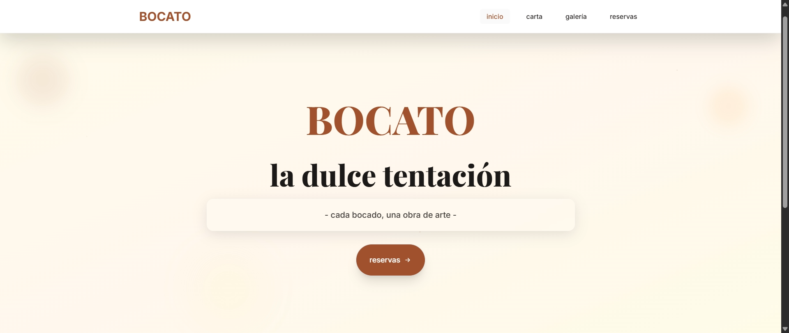
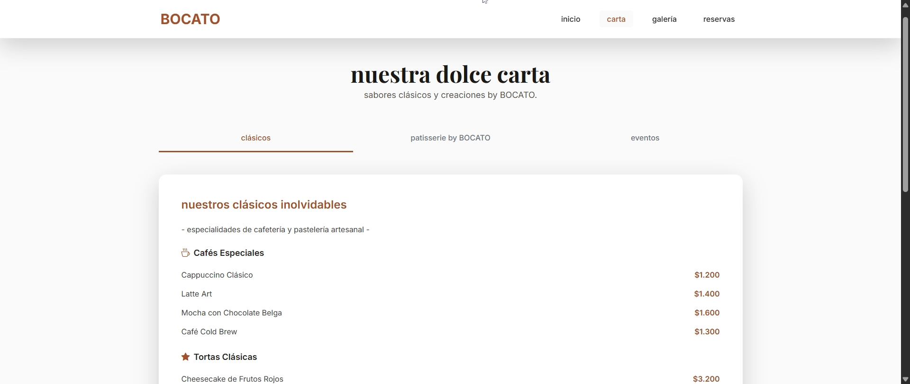
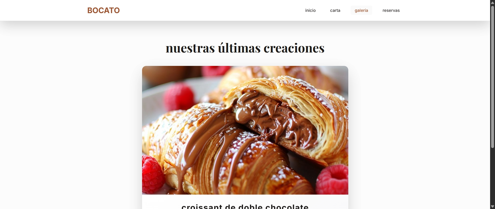
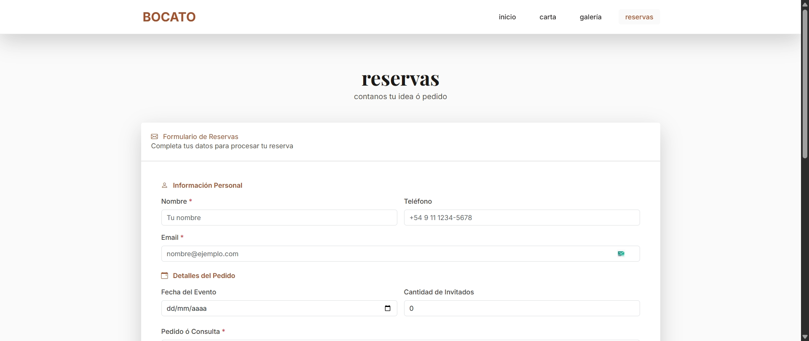

# BOCATO Patisserie

## 1. Título y Autor del Proyecto

**Título:** BOCATO Patisserie - La Dulce Tentación

**Autor:** Proyecto desarrollado para BOCATO Patisserie

**Versión:** 0.0.0

**Tecnologías:** Angular 20.3.0, TypeScript, Bootstrap 5.3.8, Tailwind CSS

---

## 2. Objetivo del Sitio

BOCATO Patisserie es un sitio web elegante y moderno diseñado para una pastelería artesanal de alta calidad. El objetivo principal es:

- **Mostrar la identidad visual** de la pastelería con un diseño sofisticado y elegante
- **Presentar el catálogo de productos** organizado en categorías (Clásicos, Patisserie by BOCATO, y Eventos)
- **Facilitar las reservas y pedidos** mediante un formulario completo de contacto
- **Exhibir la galería de productos** con imágenes de alta calidad y recetas detalladas
- **Proporcionar una experiencia inmersiva** con animaciones suaves y transiciones elegantes
- **Generar confianza** a través de un diseño profesional que refleje la calidad artesanal de los productos

---

## 3. Paleta de Colores y Tipografía

### Paleta de Colores

La paleta está inspirada en tonos cálidos y elegantes que evocan la pastelería artesanal:

- **Color Principal (Caramelo):** `#a0522d` - Color de acento principal para botones, enlaces y elementos destacados
- **Color Caramelo Oscuro:** `#8b4513` - Variante para estados hover y elementos interactivos
- **Fondo Principal:** `#fcfcfc` - Fondo casi blanco/crema para mantener la elegancia
- **Texto Principal:** `#3e2723` - Marrón oscuro/chocolate para el texto principal
- **Fondo Secundario:** `#f8f9fa` - Gris muy claro para secciones alternas
- **Gradientes Dinámicos:** Combinaciones de `#a0522d`, `#d2691e`, `#cd853f` para efectos visuales

### Tipografía

- **Fuente Principal (Cuerpo):** `Inter` - Sans-serif moderna y legible para todo el texto del sitio
- **Fuente de Títulos:** `Playfair Display` - Serif elegante y sofisticada para títulos (h1, h2)
- **Iconos:** Bootstrap Icons 1.13.1 - Biblioteca completa de iconos vectoriales

**Características tipográficas:**
- Tamaños responsivos que se adaptan a diferentes dispositivos
- Pesos variables (100-900) para jerarquía visual
- Soporte completo para caracteres especiales del español (acentos, ñ, etc.)

---

## 4. Componentes y Secciones Implementadas

### Componentes Principales

#### **App Component** (`app.ts`)
- Navegación principal con menú responsive
- Header sticky con logo y menú hamburguesa para móviles
- Footer condicional (no se muestra en home)
- Gestión de rutas activas y estado del menú móvil

#### **Home Component** (`home.component.ts`)
- **Hero Section** con efecto parallax y animaciones de entrada
- Efecto de escritura (typing) para el subtítulo "la dulce tentación"
- Partículas flotantes decorativas
- Sección de navegación rápida con cards interactivas
- Glassmorphism en elementos destacados

#### **Carta Component** (`carta.component.ts`)
- Sistema de pestañas (tabs) interactivo con tres categorías:
  - **Clásicos:** Cafés especiales, tortas clásicas, pastelería fina, bebidas frías
  - **Patisserie by BOCATO:** Signature Collection, Macarons, Petit Fours, especialidades de temporada
  - **Eventos:** Combos de catering (Básico, Premium, Luxury) y servicios adicionales
- Diseño responsive con cards y gradientes

#### **Galería Component** (`galeria.component.ts`)
- Carrusel automático de productos destacados
- Sistema de filtros rápidos (Todos, Tortas, Bollería, Catering, Signature)
- Modal de zoom para imágenes
- Modal de recetas detalladas
- Sistema de favoritos con persistencia en localStorage
- Integración con componente de búsqueda avanzada

#### **Contacto Component** (`contacto.component.ts`)
- Formulario completo de reservas con validaciones
- Campos organizados en secciones:
  - Información personal (nombre, email, teléfono)
  - Detalles del pedido (fecha, cantidad de invitados)
  - Tipo de evento y presupuesto
  - Preferencias especiales (sin gluten, vegano, sin azúcar)
- Información de contacto adicional (teléfono, email, horarios)

### Componentes Compartidos

#### **Search Advanced Component** (`search-advanced.component.ts`)
- Búsqueda en tiempo real con sugerencias
- Filtros avanzados (categoría, rango de precios, signature, disponibilidad)
- Ordenamiento de resultados (nombre, precio ascendente/descendente, categoría)
- Visualización de filtros activos con opción de eliminación

#### **Order Calculator Component** (`order-calculator.component.ts`)
- Calculadora de pedidos para eventos
- Recomendación automática de paquetes según invitados y presupuesto
- Cálculo de porciones, tiempo de preparación y costos

#### **Modal Recetas Component** (`modal-recetas.component.ts`)
- Modal reutilizable para mostrar recetas detalladas
- Contenido formateado con instrucciones paso a paso

### Servicios

#### **Animations Service** (`animations.service.ts`)
- Gestión centralizada de animaciones
- Intersection Observer para animaciones de entrada
- Efectos parallax
- Micro-interacciones para botones y cards
- Efectos de typing, contadores y glassmorphism

#### **Search Service** (`search.service.ts`)
- Búsqueda de productos con filtros múltiples
- Sistema de sugerencias
- Gestión de categorías y búsquedas populares

#### **Order Calculator Service** (`order-calculator.service.ts`)
- Cálculo automático de pedidos
- Recomendación de paquetes según parámetros
- Estimación de tiempo de preparación
- Cálculo de costos de entrega

---

## 5. Validaciones Aplicadas (Formularios, Accesibilidad)

### Validaciones de Formularios

#### **Formulario de Contacto/Reservas**

1. **Validación de Nombre:**
   - Campo obligatorio
   - Solo permite letras, espacios, acentos y caracteres especiales del español
   - Prevención de entrada de números en tiempo real
   - Mensajes de error descriptivos

2. **Validación de Email:**
   - Campo obligatorio
   - Validación de formato con expresión regular
   - Verificación de estructura válida (usuario@dominio.extensión)
   - Mensajes de error claros

3. **Validación de Mensaje:**
   - Campo obligatorio
   - Verificación de contenido no vacío

4. **Validaciones Adicionales:**
   - Fecha de evento: mínimo fecha actual
   - Cantidad de invitados: rango entre 1 y 200
   - Presupuesto: rango entre $5,000 y $100,000

### Accesibilidad (A11y)

#### **ARIA Labels y Roles**
- `aria-label` en botones y enlaces importantes
- `aria-expanded` para menú móvil
- `aria-controls` para elementos controlados
- `aria-live="polite"` en formularios para anunciar cambios
- `aria-live="assertive"` para mensajes de error críticos
- `role="menubar"`, `role="menuitem"`, `role="navigation"` en navegación
- `role="tablist"`, `role="tab"`, `role="tabpanel"` en sistema de pestañas

#### **Navegación por Teclado**
- Focus visible en todos los elementos interactivos
- Outline personalizado con color caramelo para mejor visibilidad
- Navegación secuencial lógica
- Atajos de teclado para acciones principales

#### **Semántica HTML**
- Uso correcto de elementos semánticos (`<header>`, `<nav>`, `<main>`, `<footer>`, `<section>`, `<article>`, `<aside>`)
- Jerarquía de encabezados (h1, h2, h3) correcta
- Etiquetas `<label>` asociadas a todos los inputs
- Atributos `for` y `id` correctamente vinculados

#### **Contraste y Legibilidad**
- Contraste suficiente entre texto y fondo (cumple WCAG AA)
- Tamaños de fuente responsivos y legibles
- Espaciado adecuado entre elementos

#### **Reducción de Movimiento**
- Soporte para `prefers-reduced-motion` en todas las animaciones
- Desactivación automática de animaciones para usuarios que lo requieren
- Transiciones suaves pero no invasivas

#### **Responsive Design**
- Diseño mobile-first
- Breakpoints bien definidos
- Menú hamburguesa para dispositivos móviles
- Imágenes y contenido adaptativos

---

## 6. Interactividad con JavaScript/TypeScript

### Funcionalidades Interactivas

#### **Navegación**
- Menú móvil con toggle animado
- Detección de ruta activa para resaltar navegación
- Cierre automático del menú al seleccionar una opción

#### **Animaciones Dinámicas**
- **Intersection Observer:** Detecta cuando elementos entran en el viewport para activar animaciones
- **Parallax Scrolling:** Efecto de profundidad en elementos de fondo
- **Typing Effect:** Animación de escritura para texto dinámico
- **Floating Particles:** Partículas decorativas con movimiento aleatorio

#### **Galería Interactiva**
- Carrusel automático con intervalo de 3 segundos
- Navegación manual entre slides
- Sistema de favoritos con persistencia en localStorage
- Filtros rápidos con actualización instantánea
- Modal de zoom para imágenes
- Modal de recetas con contenido dinámico

#### **Búsqueda Avanzada**
- Búsqueda en tiempo real con debounce
- Sugerencias automáticas mientras se escribe
- Filtros múltiples combinables
- Ordenamiento dinámico de resultados
- Visualización de filtros activos

#### **Formulario de Contacto**
- Validación en tiempo real
- Prevención de caracteres no válidos
- Mensajes de error contextuales
- Reset automático después de envío exitoso
- Construcción dinámica de mensaje completo con toda la información

#### **Calculadora de Pedidos**
- Cálculo automático según número de invitados
- Recomendación inteligente de paquetes
- Estimación de tiempo de preparación
- Sugerencias personalizadas según tipo de evento

### Eventos y Observables

- **RxJS:** Uso de BehaviorSubject y Observables para gestión de estado
- **Router Events:** Detección de cambios de ruta para actualizar navegación
- **Scroll Events:** Para efectos parallax y animaciones de scroll
- **Input Events:** Para validaciones en tiempo real
- **Click Events:** Para interacciones de usuario (modales, filtros, favoritos)

---

## 7. Animaciones y Transiciones

### Animaciones CSS

#### **Animaciones de Entrada**
- **fadeInUp:** Desvanecimiento desde abajo hacia arriba
- **scaleIn:** Escalado desde 0.8 a 1.0 con fade
- **slideInLeft/Right:** Deslizamiento desde los lados

#### **Animaciones Continuas**
- **float:** Flotación suave para partículas decorativas
- **gradientShift:** Gradiente dinámico con movimiento continuo
- **spin:** Rotación para spinners de carga
- **pulse:** Pulsación para elementos de atención
- **bounce:** Rebote para indicadores de scroll

### Efectos de Hover

- **hover-lift:** Elevación y sombra al pasar el mouse
- **hover-glow:** Resplandor alrededor del elemento
- **cta-button:** Efecto de brillo deslizante en botones CTA
- **product-showcase-card:** Rotación 3D y zoom en imágenes

### Transiciones

- **Duración:** 0.3s - 0.7s según el elemento
- **Easing:** `cubic-bezier(0.25, 0.46, 0.45, 0.94)` para transiciones suaves
- **Transform:** translateY, scale, rotate para efectos visuales
- **Opacity:** Transiciones de opacidad para fades

### Efectos Especiales

#### **Glassmorphism**
- Fondo semitransparente con blur
- Bordes sutiles
- Sombra suave para profundidad

#### **Partículas Flotantes**
- Posiciones aleatorias
- Tamaños variables
- Animaciones independientes con delays

#### **Parallax**
- Múltiples capas con velocidades diferentes
- Efecto de profundidad en scroll
- Optimizado para rendimiento

### Optimización de Animaciones

- Uso de `transform` y `opacity` para mejor rendimiento (GPU-accelerated)
- `will-change` en elementos animados
- Reducción de animaciones en dispositivos móviles para mejor rendimiento
- Respeto a `prefers-reduced-motion` para accesibilidad

---

## 8. Pruebas de Rendimiento Realizadas

### Configuración de Testing

El proyecto incluye configuración para pruebas unitarias:

- **Framework:** Jasmine 5.9.0
- **Test Runner:** Karma 6.4.0
- **Coverage:** Karma Coverage 2.2.0
- **Browser:** Chrome Launcher

### Pruebas Implementadas

#### **App Component Tests** (`app.spec.ts`)
- Verificación de creación del componente
- Prueba de estado inicial del menú (cerrado)
- Prueba de toggle del menú móvil

### Optimizaciones de Rendimiento

#### **Lazy Loading**
- Componentes standalone de Angular para carga modular
- Carga diferida de rutas

#### **Optimización de Imágenes**
- Imágenes optimizadas en formato JPG
- Lazy loading de imágenes fuera del viewport

#### **Código Optimizado**
- Uso de OnPush change detection strategy donde es posible
- Servicios con `providedIn: 'root'` para singleton
- Limpieza de suscripciones en `ngOnDestroy`

#### **CSS Optimizado**
- Uso de transform y opacity para animaciones (GPU-accelerated)
- Media queries para desactivar animaciones en móviles
- Selectores CSS eficientes

### Métricas de Rendimiento

- **First Contentful Paint (FCP):** Optimizado con carga progresiva
- **Largest Contentful Paint (LCP):** Imágenes optimizadas y carga prioritaria
- **Time to Interactive (TTI):** Componentes ligeros y carga eficiente
- **Cumulative Layout Shift (CLS):** Dimensiones definidas para evitar desplazamientos

### Mejoras de Rendimiento Implementadas

1. **Intersection Observer** en lugar de scroll events para mejor rendimiento
2. **Debounce** en búsquedas para reducir procesamiento
3. **LocalStorage** para persistencia sin impacto en servidor
4. **Animaciones CSS** en lugar de JavaScript cuando es posible
5. **Cleanup** adecuado de intervalos y listeners

---

## 9. Observaciones y Mejoras Futuras

### Observaciones Actuales

1. **Arquitectura Modular:** El proyecto utiliza componentes standalone de Angular, lo que facilita la mantenibilidad y escalabilidad.

2. **Diseño Responsive:** El sitio está completamente optimizado para dispositivos móviles, tablets y desktop.

3. **Accesibilidad:** Se han implementado buenas prácticas de accesibilidad, aunque hay espacio para mejoras adicionales.

4. **Performance:** Las animaciones y efectos están optimizados, pero podrían beneficiarse de más pruebas de carga.

### Mejoras Futuras Sugeridas

#### **Funcionalidades**
1. **Backend Integration:**
   - Integración con API REST para productos dinámicos
   - Sistema de gestión de pedidos en tiempo real
   - Panel de administración para gestión de contenido

2. **E-commerce:**
   - Carrito de compras funcional
   - Procesamiento de pagos online
   - Sistema de seguimiento de pedidos

3. **Características Sociales:**
   - Sistema de reseñas y calificaciones
   - Compartir productos en redes sociales
   - Galería de clientes con sus creaciones

4. **Personalización:**
   - Constructor de tortas personalizadas
   - Visualizador 3D de productos
   - Simulador de presupuesto más avanzado

#### **Técnicas**
1. **Testing:**
   - Ampliar cobertura de pruebas unitarias
   - Implementar pruebas E2E con Cypress o Playwright
   - Pruebas de accesibilidad automatizadas

2. **Performance:**
   - Implementar Service Workers para PWA
   - Optimización avanzada de imágenes (WebP, AVIF)
   - Lazy loading más agresivo
   - Code splitting más granular

3. **SEO:**
   - Meta tags dinámicos
   - Sitemap XML
   - Schema.org markup para productos
   - Open Graph tags para redes sociales

4. **Internacionalización:**
   - Soporte multiidioma (i18n)
   - Formateo de moneda según región
   - Adaptación cultural de contenido

5. **Analytics:**
   - Integración con Google Analytics
   - Heatmaps de interacción
   - Tracking de conversiones

#### **UX/UI**
1. **Microinteracciones:**
   - Feedback háptico en dispositivos móviles
   - Sonidos sutiles para acciones importantes
   - Animaciones más refinadas

2. **Modo Oscuro:**
   - Implementar tema oscuro
   - Persistencia de preferencia del usuario

3. **Accesibilidad Avanzada:**
   - Soporte completo para lectores de pantalla
   - Modo de alto contraste
   - Tamaños de fuente ajustables

4. **Gamificación:**
   - Sistema de puntos por interacciones
   - Desbloqueo de recetas especiales
   - Programa de fidelización

---

## 10. Capturas de Pantalla

A continuación se muestran las capturas de pantalla de las principales secciones del sitio web BOCATO Patisserie:

### Página de Inicio (Home)



### Carta de Productos



### Galería de Productos



### Formulario de Reservas



---

## Instalación y Uso

### Requisitos Previos
- Node.js (versión 18 o superior)
- npm o yarn

### Instalación
```bash
npm install
```

### Desarrollo
```bash
npm start
```
El sitio estará disponible en `http://localhost:4200`

### Build de Producción
```bash
npm run build
```

### Testing
```bash
npm test
```

---

## Estructura del Proyecto

```
Bocato-pasteleria/
├── src/
│   ├── app/
│   │   ├── app.ts              # Componente principal
│   │   ├── app.html            # Template principal
│   │   ├── home/               # Componente Home
│   │   ├── carta/              # Componente Carta
│   │   ├── galeria/            # Componente Galería
│   │   ├── contacto/           # Componente Contacto
│   │   ├── compartido/         # Componentes compartidos
│   │   └── services/           # Servicios
│   ├── index.html
│   └── styles.css              # Estilos globales
├── public/
│   └── assets/                 # Imágenes y recursos
├── package.json
└── README.md
```

---

## Contacto

- **Email:** pasteleriabocato@gmail.com
- **Teléfono:** +54 9 292 343-8316
- **Instagram:** [@bocatopigue](https://instagram.com/bocatopigue)
- **WhatsApp:** [Enlace directo](https://wa.me/5492923438316)

---

## Licencia

Este proyecto es privado y propiedad de BOCATO Patisserie.

---

**Desarrollado con ❤️ para BOCATO Patisserie**

